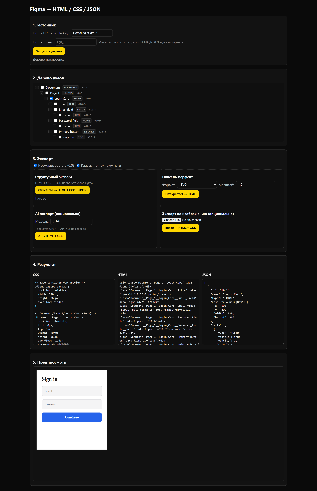
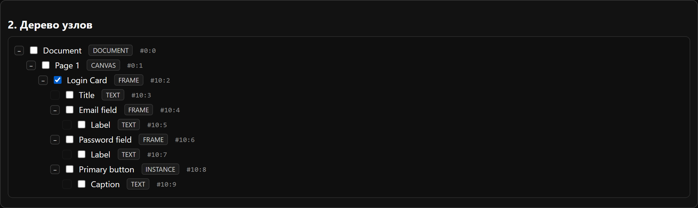
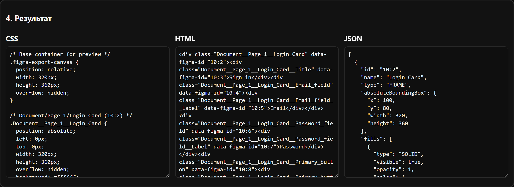
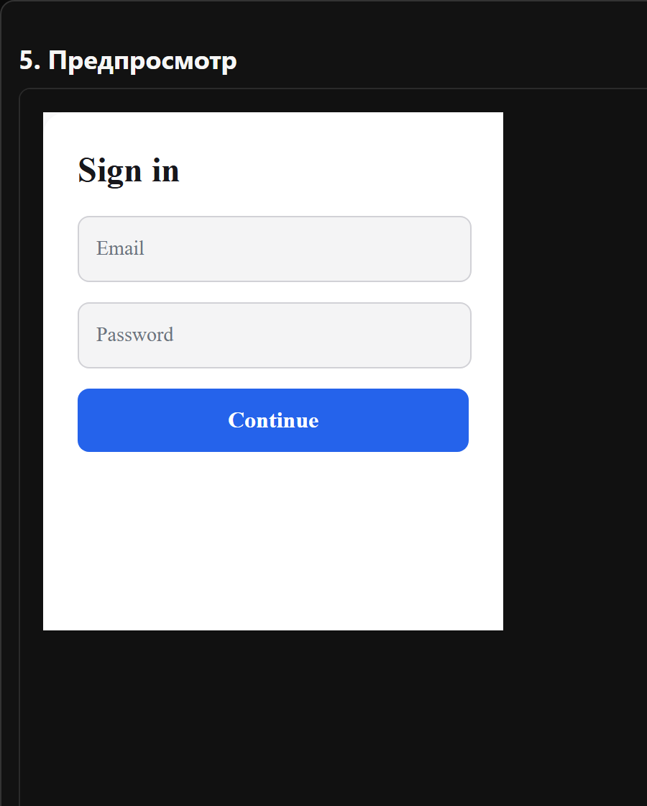
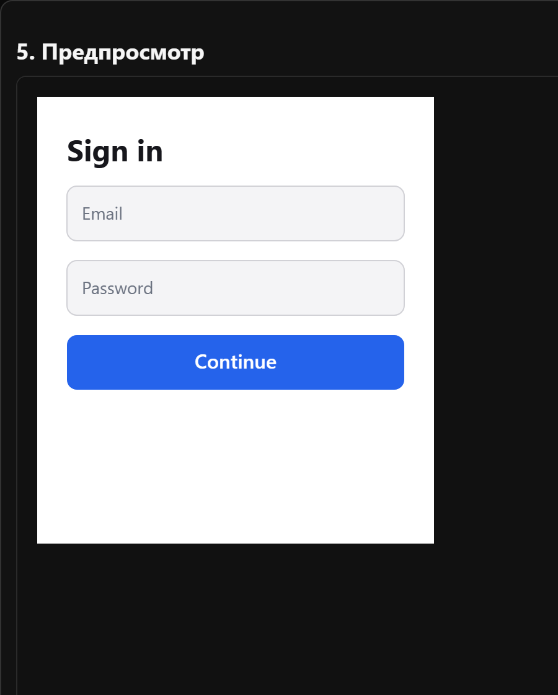
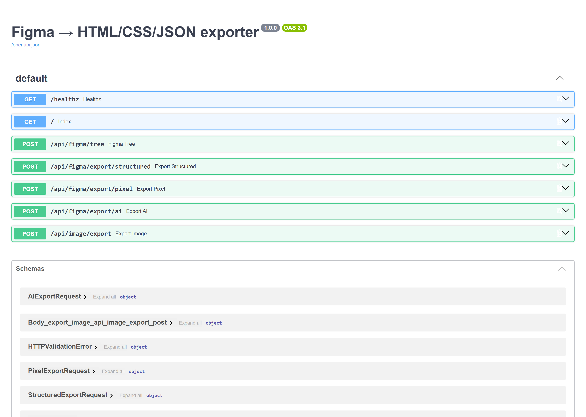

# Экспортёр Figma в HTML, CSS и JSON

Веб-сервис и HTTP API, которые читают файл Figma через REST API и превращают
выбранные узлы в готовую разметку. Макет загружается по ссылке или `file key`,
узлы отмечаются в дереве, а результат — HTML, CSS и JSON — открывается во
встроенном предпросмотре.

Экспорт работает в четырёх режимах: структурный (по свойствам узлов),
пиксель-перфект (композиция изображений, отрисованных Figma), экспорт с
обработкой моделью OpenAI и экспорт по загруженному скриншоту.



## Возможности

- загрузка макета по ссылке Figma или `file key`;
- дерево узлов файла с выбором элементов для экспорта;
- структурный экспорт HTML, CSS и JSON из геометрии, заливок, обводок, теней, типографики и auto-layout;
- пиксель-перфект: SVG или PNG узлов от Figma, собранные в разметку с абсолютным позиционированием;
- экспорт HTML и CSS с обработкой моделью OpenAI по описанию и изображениям узлов;
- экспорт HTML и CSS по загруженному скриншоту с опциональной сверкой отрисовки через Playwright;
- встроенный предпросмотр результата;
- ограничения на размер ответов Figma, число выбранных узлов и объём загрузок;
- поддержка ссылок вида `https://www.figma.com/design/<key>/<name>?node-id=<id>`.

## Интерфейс

| Дерево узлов файла | HTML, CSS и JSON структурного экспорта |
| --- | --- |
|  |  |

| Предпросмотр структурного экспорта | Предпросмотр пиксель-перфект экспорта |
| --- | --- |
|  |  |



## Стек

- Python 3.11+;
- FastAPI 0.141, Starlette 1.6, Uvicorn 0.52;
- Pydantic 2, pydantic-settings, httpx;
- pytest, ruff, pip-audit;
- OpenAI SDK — для экспорта с обработкой моделью;
- Pillow и Playwright — для экспорта по изображению;
- Docker.

## Структура

```text
figma_exporter/            приложение FastAPI, клиент Figma REST и общая логика
figma_exporter/exporters/  режимы structured, pixel, ai и image
static/                    веб-интерфейс из одной страницы
examples/                  демо-фикстура Figma и собранный из неё экспорт
tests/                     набор pytest
```

## Запуск

Требуется Docker.

```bash
docker build -t figma-exporter .
docker run --rm -p 8000:8000 figma-exporter
```

- веб-интерфейс: http://localhost:8000/
- документация OpenAPI: http://localhost:8000/docs
- проверка состояния: http://localhost:8000/healthz

Образ слушает `0.0.0.0:8000` и работает без настройки. Чтобы задать токен Figma и
ключ OpenAI, подключите файл окружения:

```bash
cp .env.example .env
docker run --rm -p 8000:8000 --env-file .env -e HOST=0.0.0.0 figma-exporter
```

Остановка — `Ctrl+C`. Контейнер разворачивается в любой среде с поддержкой Docker.

## Локальная разработка

Требуется Python 3.11+.

```bash
python -m venv .venv
. .venv/Scripts/activate        # macOS/Linux: . .venv/bin/activate
pip install -r requirements.txt
cp .env.example .env
python -m figma_exporter
```

- сервер: http://127.0.0.1:8000/

Дополнительные режимы:

```bash
pip install -r requirements-ai.txt       # экспорт с обработкой моделью
pip install -r requirements-image.txt    # экспорт по изображению
python -m playwright install chromium     # сверка отрисовки
```

Демо-экспорт из фикстуры, без токена Figma:

```bash
python examples/render_demo.py
```

## Конфигурация

| Переменная | Назначение |
| --- | --- |
| `FIGMA_TOKEN` | токен Figma REST API |
| `OPENAI_API_KEY` | ключ OpenAI для режимов с обработкой моделью |
| `HOST`, `PORT` | адрес и порт сервера |
| `HTTP_TIMEOUT_SECONDS` | таймаут запросов к Figma |
| `HTTP_MAX_RESPONSE_BYTES` | предельный размер ответа Figma |
| `MAX_SELECTED_IDS` | предельное число выбранных узлов |
| `MAX_UPLOAD_BYTES` | предельный размер загружаемого изображения |
| `OPENAI_DEFAULT_MODEL` | модель по умолчанию для режимов с обработкой моделью |

Токен Figma можно не задавать в окружении, а передавать в теле запроса. Полный
список — в `.env.example`.

## API

| Метод | Путь | Назначение |
| --- | --- | --- |
| `GET` | `/healthz` | проверка состояния |
| `GET` | `/` | веб-интерфейс |
| `GET` | `/docs` | документация OpenAPI |
| `POST` | `/api/figma/tree` | дерево узлов файла |
| `POST` | `/api/figma/export/structured` | структурный экспорт |
| `POST` | `/api/figma/export/pixel` | пиксель-перфект экспорт |
| `POST` | `/api/figma/export/ai` | экспорт с обработкой моделью |
| `POST` | `/api/image/export` | экспорт по загруженному изображению |

## Команды

```bash
pip install -r requirements-dev.txt
ruff check .
ruff format --check .
pytest
```

## Источники данных

Сервис обращается к Figma REST API; состав и формат ответов задаёт Figma и может
меняться. Figma — товарный знак Figma, Inc.; проект с ней не связан.
